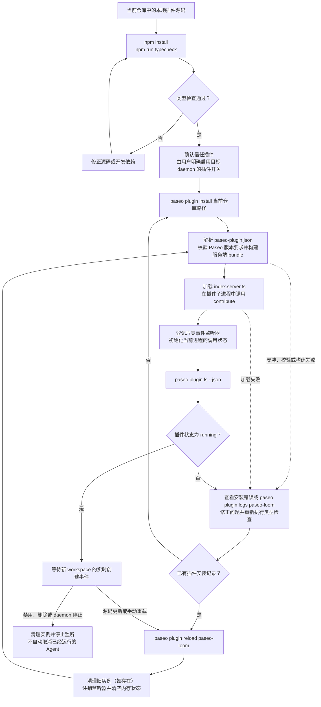
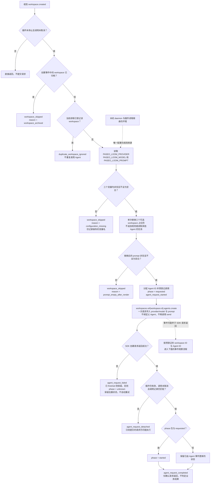
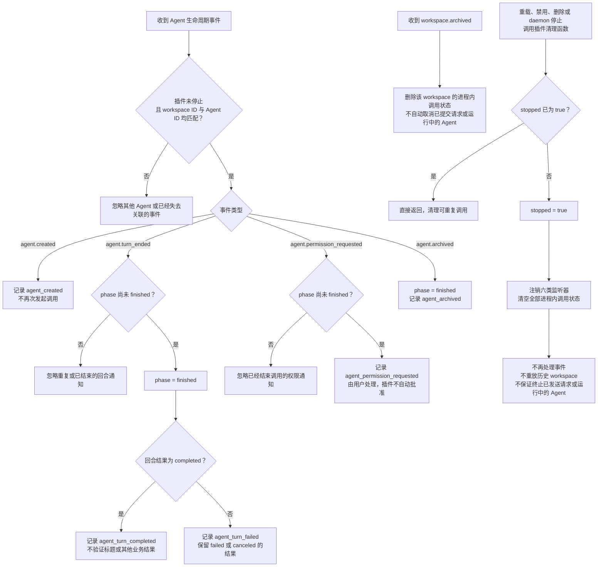

# paseo-loom

`paseo-loom` 是一个仅在服务端运行的 Paseo 插件。它监听新 workspace 的创建事件，读取本机 Paseo daemon 环境中的配置，并在该 workspace 内调用配置好的 Agent。对应环境变量缺失或为空时，插件跳过处理。

**插件本身不提供实质性的重命名规则。** Agent 使用哪个 provider、哪个模型、执行什么规则，都由环境变量指定。是否重命名、如何生成标题、是否调用某个 Skill，以及业务层面的跳过条件，都由配置的 prompt 决定；插件不内置这些行为，也不直接修改标题。

## 安装与调用生命周期

以下三张图分别描述插件的安装管理、workspace 创建后的调用，以及 Agent 事件观察与清理。环境变量是否齐全不影响插件本身的加载；插件可以处于 `running` 状态，但在配置缺失时跳过 Agent 调用。

### 安装、加载与重载



### workspace 创建与 Agent 调用



调用只由 `workspace.created` 发起，不要求已经存在其他 Agent 或用户任务。SDK 请求返回与 Agent 事件没有固定先后顺序；请求失败也不代表规则一定没有执行，因此插件不会自动重试。

### Agent 事件观察、归档与清理



业务规则及其验收方式始终由 `PASEO_LOOM_PROMPT` 决定。以上日志只反映插件和 Agent 的生命周期，不代表重命名或其他业务操作已经成功。重载或重启后会建立新的进程内状态，不具备跨重启的严格单次执行保证。

## 配置

插件读取以下三个环境变量：

| 环境变量 | 用途 |
| --- | --- |
| `PASEO_LOOM_PROVIDER` | 执行规则的 Agent provider |
| `PASEO_LOOM_MODEL` | 使用的模型 |
| `PASEO_LOOM_PROMPT` | 交给 Agent 执行的完整规则或指令 |

任一变量未设置、为空或仅包含空白时，跳过当前 workspace，不创建 Agent。插件只记录缺失的变量名，不记录配置值。每次处理新 workspace 时重新读取配置，不使用内置默认规则。

这些变量必须存在于实际 Paseo daemon 及插件进程所继承的环境中。只在另一个终端中 export，并不代表运行中的 daemon 已获得配置。

`PASEO_LOOM_PROMPT` 可以是普通文本，不要求调用特定 Skill，也不要求包含任何占位符。插件不追加命名规则、不抽取用户会话、不替用户决定如何处理已有标题。除下列可选占位符替换外，prompt 的内容和空白均保持不变：

| 可选占位符 | 替换内容 |
| --- | --- |
| `{{workspace_id}}` | 触发事件的稳定 workspace ID |
| `{{cwd}}` | 该 workspace 的目录 |
| `{{workspace_title}}` | 创建事件中的 workspace 名称；为空时替换为空字符串 |

占位符只替换一次，替换值不会被再次展开。其他占位符原样保留。如果替换后的 prompt 为空或仅含空白，插件也会跳过处理，避免创建没有指令的 Agent。插件不提供 `{{task_prompt}}` 或 `{{source_agent_id}}`；如果旧规则依赖它们，需要调整规则。规则需要额外上下文时，应在 prompt 中明确指定获取方式和处理条件。

下面仅展示配置文本的结构，不是插件内置规则。请将最后一行替换为你实际希望 Agent 执行的规则，再将完整文本设置为 `PASEO_LOOM_PROMPT`：

```text
目标 workspaceId={{workspace_id}}，目录为 {{cwd}}，当前名称为 {{workspace_title}}。
<在这里填写实际规则，包括需要的 Skill、处理范围、跳过条件和结果验证方式>
```

如果规则要求使用某个 Skill，所选 provider 必须能够发现该 Skill 并执行其脚本。插件不依赖或强制调用 `/paseo-batch-name-sessions`。

## Agent 调用流程

1. 收到 `workspace.created` 后，检查 workspace 是否已归档、调用是否已取消，以及当前进程是否已经处理该 workspace。
2. 读取三个 `PASEO_LOOM_*` 环境变量。缺少配置时立即跳过，不等待其他 Agent，也不读取任务时间线。
3. 为本次调用分配 Agent ID，并先登记进程内的去重状态，防止重复或并发事件触发多次调用。
4. 通过 `context.paseo.workspaces.ref(workspace.id).agents.create(...)` 在准确的 workspace 中创建 Agent。配置中的 `provider` 使用 SDK 要求的 `provider/model` 格式，规则通过同一次创建请求的 `prompt` 传入，不再另发一次 `send()`。
5. 调用不绑定其他 Agent 为父 Agent，也不等待原任务回合结束。后续 Agent 事件仅用于日志观察，不能再次触发规则执行。
6. 按预先登记的 workspace ID 和 Agent ID 记录创建、完成、失败、取消、权限请求和归档事件。即使 Agent 很快完成、事件早于创建请求返回，也能关联本次调用。

插件只负责环境配置读取、必要的 workspace 信息替换和 Agent 调用。Agent 的实际动作及结果验证方式由规则决定；Agent 回合完成不代表标题已重命名，也不代表规则的业务结果已经通过验收。

## 日志与失败处理

日志采用 JSON Lines 格式，包含 `plugin`、`event`、`timestamp` 以及相关 workspace／Agent ID：

- `workspace_skipped`：配置缺失、替换后的 prompt 为空或 workspace 已归档，未发起 Agent 调用。
- `duplicate_workspace_ignored`：忽略当前进程已经登记的 workspace 创建事件。
- `agent_request_started`：已登记 Agent ID，开始提交创建与初始 prompt 请求。
- `agent_created`：收到该 Agent 的创建事件，不代表规则已执行完成。
- `agent_request_completed`：SDK 创建请求返回，仍不代表规则的业务结果成功。
- `agent_request_failed`：请求失败，实际创建或 prompt 投递结果可能不确定；应按日志中的 Agent ID 检查状态。
- `agent_request_detached`：请求返回时，插件已清理、workspace 已归档或调用已取消。已经提交的请求仍可能产生 Agent 或执行 prompt。
- `agent_turn_completed` / `agent_turn_failed`：观察到 Agent 回合完成、失败或取消，只记录回合结果，不判定标题或其他业务结果。
- `agent_permission_requested`：Agent 需要用户处理权限请求；插件不会自动批准。
- `agent_archived`：该 Agent 已归档。

开始提交请求后，即使出现失败或超时，也保留当前进程内的去重状态，不自动重试。创建失败不一定意味着没有创建出 Agent，prompt 投递失败也不一定意味着未执行规则；自动重试可能产生重复 Agent 或重复执行。

workspace 归档时清除对应状态；插件清理时注销监听器并清空内存。清理或取消不保证终止已经发送的请求或已经运行的 Agent。

事件是实时、尽力而为的投递，没有历史重放或定时重试。插件重新加载或 daemon 重启会丢失去重状态；此版本不保证跨重启的严格单次执行，也不会补处理插件未运行期间创建的 workspace。

## 本地开发

```bash
npm install
npm run typecheck
```

配置好 daemon 环境，并在目标主机上明确启用插件后，安装和检查此插件：

```bash
paseo plugin install "$PWD"
paseo plugin ls --json
paseo plugin reload paseo-loom
paseo plugin logs paseo-loom
```

## 本地验收

- 分别测试三个环境变量缺失、空字符串和纯空白的情况。插件应跳过处理，不创建 Agent；日志只指出缺失的配置键。
- 使用不包含占位符、不调用命名 Skill 的普通 prompt 创建新 workspace。无需已有 Agent 或用户任务，插件也应按环境配置发起调用。
- 检查实际调用的 provider/model、完整 prompt、Agent ID 和 workspace ID；确认没有插件追加的规则、父 Agent 绑定或第二次 prompt 发送。
- 检查三个可选占位符、替换值中的占位符和替换元字符，以及未识别的占位符。只执行一次已支持的替换，其他内容保持原样；替换后没有有效指令时跳过调用。
- 验证重复和并发 workspace 创建事件只发起一次调用；普通 Agent 创建或回合结束事件不能触发新调用。
- 测试快速完成、创建失败、初始 prompt 失败、权限等待、取消和归档；确认事件按准确 Agent ID 关联，且不自动重试或批准权限。
- 根据你配置的实际规则验证业务结果。只有当环境中的规则要求重命名时，才检查标题、处理范围及相关 Skill 的执行情况。

类型检查和本地事件模拟不能替代 daemon 级验收。安装插件、修改或重启 daemon，以及运行真实 Agent，都属于单独的操作步骤。
