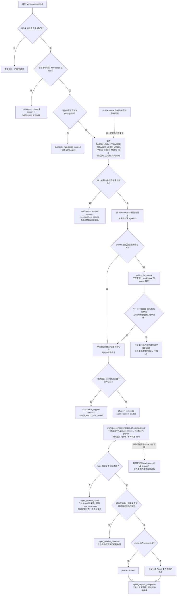
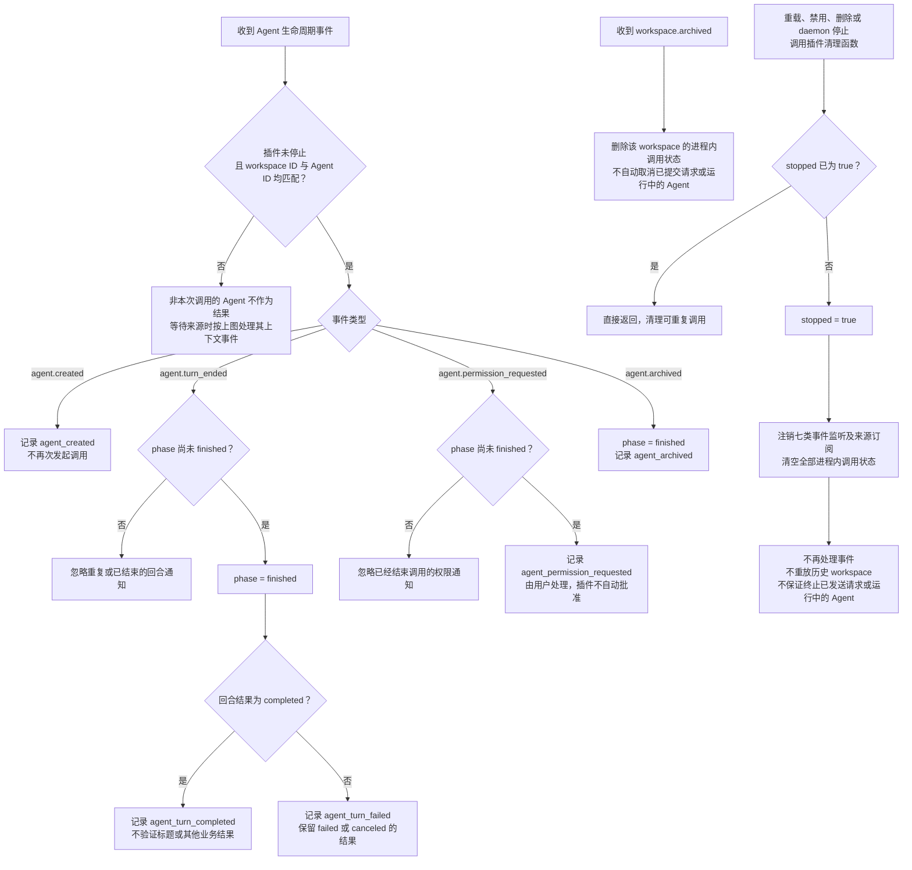

# paseo-loom

`paseo-loom` 是一个仅在服务端运行的 Paseo 插件。它监听新 workspace 的创建事件，读取本机 Paseo daemon 环境中的配置，并在该 workspace 内调用配置好的 Agent。对应环境变量缺失或为空时，插件跳过处理。

**插件本身不提供实质性的重命名规则。** Agent 使用哪个 provider、哪个模型、哪种权限模式、执行什么规则，都由环境变量指定。是否重命名、如何生成标题、是否调用某个 Skill，以及业务层面的跳过条件，都由配置的 prompt 决定；插件不内置这些行为，也不直接修改标题。

## 安装与调用生命周期

以下三张图分别描述插件的安装管理、workspace 创建后的调用，以及 Agent 事件观察与清理。环境变量是否齐全不影响插件本身的加载；插件可以处于 `running` 状态，但在配置缺失时跳过 Agent 调用。

### 安装、加载与重载


### workspace 创建与 Agent 调用



不使用来源占位符时，`workspace.created` 仍立即发起调用，不要求已有其他 Agent 或用户任务；显式使用来源占位符时，才等待同一 workspace 的关联 Agent。SDK 请求返回与 Agent 事件没有固定先后顺序；请求失败也不代表规则一定没有执行，因此插件不会自动重试。

### Agent 事件观察、归档与清理



业务规则及其验收方式始终由 `PASEO_LOOM_PROMPT` 决定。以上日志只反映插件和 Agent 的生命周期，不代表重命名或其他业务操作已经成功。重载或重启后会建立新的进程内状态，不具备跨重启的严格单次执行保证。

## 配置

插件读取以下四个环境变量：

| 环境变量 | 用途 |
| --- | --- |
| `PASEO_LOOM_PROVIDER` | 执行规则的 Agent provider |
| `PASEO_LOOM_MODEL` | 使用的模型 |
| `PASEO_LOOM_MODE_ID` | provider 的权限／会话模式 ID，作为 SDK 的 `config.modeId` 显式传入 |
| `PASEO_LOOM_PROMPT` | 交给 Agent 执行的完整规则或指令 |

任一变量未设置、为空或仅包含空白时，跳过当前 workspace，不创建 Agent。插件只记录缺失的变量名，不记录配置值。每次处理新 workspace 时重新读取配置，不使用内置默认规则。

这些变量必须存在于实际 Paseo daemon 及插件进程所继承的环境中。只在另一个终端中 export，并不代表运行中的 daemon 已获得配置。

### 权限模式有效值

权限模式必须显式配置，不能只设置 provider/model 或在 prompt 中要求“不要询问”。旧版本未传入 `modeId`，创建的 Agent 可能使用默认权限并停在 MCP 工具授权请求上。升级后缺少 `PASEO_LOOM_MODE_ID` 时直接跳过，不再静默创建默认权限的 Agent。

请使用所选 provider 支持的模式 **ID**，而不是界面显示名称。ID 区分大小写。以下是 Paseo 原生 Codex 和 Claude Code 的模式；自定义 provider、客户端版本或运行环境可能影响实际可用值，应以目标 provider 的能力查询返回的 `modes[].id` 为准。

**Codex 及兼容 provider**

| `PASEO_LOOM_MODE_ID` | 界面名称 | 权限行为 |
| --- | --- | --- |
| `auto` | Default Permissions | 默认权限，工具调用可能需要人工授权 |
| `auto-review` | Auto-review | 自动审查部分符合条件的授权，不保证所有请求都无需人工处理 |
| `full-access` | Full Access | 允许文件操作、命令执行和网络访问，无需额外权限提示；权限范围更广 |

**Claude Code 及兼容 provider**

| `PASEO_LOOM_MODE_ID` | 界面名称 | 权限行为 |
| --- | --- | --- |
| `plan` | Plan Mode | 规划分析模式，不适合需要自动写入的规则 |
| `default` | Always Ask | 默认交互授权，工具调用可能需要人工确认 |
| `acceptEdits` | Accept File Edits | 自动批准编辑类工具，不保证命令或 MCP 工具免授权 |
| `auto` | Auto mode | 使用模型分类器自动审查权限请求，不保证全部请求都能无人值守完成 |
| `bypassPermissions` | Bypass | 跳过权限提示，具有高风险，必须由用户明确选择 |

`auto` 在 Codex 中表示默认权限，在 Claude Code 中表示自动权限审查，不能视为同一种授权策略。Codex 的 `full-access` 和 Claude Code 的 `bypassPermissions` 也不能跨 provider 混用。只有在你明确接受所配置规则获得广泛权限时，才选择对应的跳过授权模式；插件不会自动选择或升级到这些模式。

不同 provider 的模式 ID 和授权行为可能不同，应先核对其能力。填写无效模式时，由 provider／daemon 校验并报告失败；插件不降级为默认权限。已有 Agent 的权限不会因修改环境或重载插件而改变，应单独检查其实际 `currentModeId`。新创建 Agent 的模式以运行时状态为准，不能仅凭界面偏好或请求已发送判定权限正确。

### Prompt 与占位符

`PASEO_LOOM_PROMPT` 可以是普通文本，不要求调用特定 Skill，也不要求包含任何占位符。插件不追加命名规则，也不替用户决定如何处理已有标题。除下列可选占位符替换外，prompt 的内容和空白均保持不变：

| 可选占位符 | 替换内容 |
| --- | --- |
| `{{workspace_id}}` | 触发事件的稳定 workspace ID |
| `{{cwd}}` | 该 workspace 的目录 |
| `{{workspace_title}}` | 创建事件中的 workspace 名称；为空时替换为空字符串 |
| `{{source_agent_id}}` | 同一 workspace 中最先观察到的非本插件 Agent 的稳定 ID；等其时间线出现用户任务后才传入 |
| `{{task_prompt}}` | 该来源 Agent 时间线中的第一条非空用户消息；仅显式使用时才注入任务原文 |

占位符只替换一次，替换值不会被再次展开。其他占位符原样保留。如果替换后的 prompt 为空或仅含空白，插件也会跳过处理，避免创建没有指令的 Agent。

仅当模板包含 `{{source_agent_id}}` 或 `{{task_prompt}}` 时，插件才按稳定 workspace ID 观察非本插件 Agent。确定来源 ID 后，先订阅该 Agent 的实时用户消息，再回读它已存的时间线以填补订阅建立时的间隙；只要出现非空用户消息，就启动处理 Agent，**不等待整个回合结束**。来源回合结束事件的完整快照只用作漏事件时的兜底。只使用 `{{source_agent_id}}` 时，插件不把任务原文写入 prompt；若显式使用 `{{task_prompt}}`，才会将原文注入，可能影响提示词行为。不会按 cwd、项目名或标题匹配，也不扫描全局 Agent 列表；如果在启动前观察到多个来源候选，则停止，不猜测哪一个是原始任务。事件没有历史重放，错过关联事件或没有用户文本时不会伪造上下文。

下面仅展示配置文本的结构，不是插件内置规则。请将最后一行替换为你实际希望 Agent 执行的规则，再将完整文本设置为 `PASEO_LOOM_PROMPT`：

```text
目标 workspaceId={{workspace_id}}，目录为 {{cwd}}，当前名称为 {{workspace_title}}。
<在这里填写实际规则，包括需要的 Skill、处理范围、跳过条件和结果验证方式>
```

如果规则要求使用某个 Skill，所选 provider 必须能够发现该 Skill 并执行其脚本。插件不依赖或强制调用 `/paseo-batch-name-sessions`。

如果规则需要关联 Agent 的原始任务，不要只要求 Agent 根据 workspace ID 自行寻找不受支持的关联接口。建议只在环境中的 prompt 里使用 `{{source_agent_id}}`，让 Agent 按这个精确 ID 读取任务，避免任务原文干扰提示词，例如：

```text
目标 workspaceId={{workspace_id}}。
来源 Agent ID={{source_agent_id}}。
使用 `paseo agent logs "{{source_agent_id}}" --filter text` 定向读取来源 Agent 的完整时间线，不加 `--tail`；只取首条真实的 `[User]` 消息，不把 `inspect` 元数据或近期活动摘要当作原始任务。
<在这里填写你自己的处理规则；只把读取的任务当作依据，不要重复执行它>
```

只有更新 `PASEO_LOOM_PROMPT` 并确保新值进入插件进程后，新 workspace 才能走这条上下文路径。已经启动的 Agent 不会收到事后补传的任务。

## Agent 调用流程

1. 收到 `workspace.created` 后，检查 workspace 是否已归档、调用是否已取消，以及当前进程是否已经处理该 workspace。
2. 读取四个 `PASEO_LOOM_*` 环境变量，包括必需的权限模式 ID。缺少配置时立即跳过。
3. 为本次调用分配 Agent ID，并先登记进程内的去重状态，防止重复或并发事件触发多次调用。只有 prompt 使用来源占位符时，才观察同一 workspace 的来源 Agent；其首条用户消息可读后立即调用，不等待回合完成。普通 prompt 不等待。
4. 通过 `context.paseo.workspaces.ref(workspace.id).agents.create(...)` 在准确的 workspace 中创建 Agent。配置中的 `provider` 使用 SDK 要求的 `provider/model` 格式，权限模式通过 `config.modeId` 显式传入，规则通过同一次创建请求的 `prompt` 传入，不再另发一次 `send()`。
5. 调用不绑定其他 Agent 为父 Agent。已经创建的处理 Agent 的事件只用于日志观察，不能再次触发规则执行。
6. 按预先登记的 workspace ID 和 Agent ID 记录创建、完成、失败、取消、权限请求和归档事件。即使 Agent 很快完成、事件早于创建请求返回，也能关联本次调用。

插件只负责环境配置读取、必要的 workspace 信息替换和 Agent 调用。Agent 的实际动作及结果验证方式由规则决定；Agent 回合完成不代表标题已重命名，也不代表规则的业务结果已经通过验收。

## 日志与失败处理

日志采用 JSON Lines 格式，包含 `plugin`、`event`、`timestamp` 以及相关 workspace／Agent ID：

- `workspace_skipped`：配置缺失、替换后的 prompt 为空或 workspace 已归档，未发起 Agent 调用。
- `duplicate_workspace_ignored`：忽略当前进程已经登记的 workspace 创建事件。
- `waiting_for_source` / `source_agent_selected`：模板要求来源上下文，等待或选中同一 workspace 的 Agent；不记录原始任务文本。
- `source_task_available`：实时消息、定向回读或回合结束兜底确认任务已可读；日志只记录获取方式和来源 ID，不记录任务原文。
- `source_task_unavailable` / `source_observation_failed`：尚无非空用户任务或实时订阅失败；后者保留回合结束兜底。
- `source_ambiguous` / `source_archived`：多个来源候选或来源在任务可读前归档时停止，不猜测来源。
- `agent_request_started`：已登记 Agent ID，开始提交创建与初始 prompt 请求。
- `agent_created`：收到该 Agent 的创建事件，不代表规则已执行完成。
- `agent_request_completed`：SDK 创建请求返回，仍不代表规则的业务结果成功。
- `agent_request_failed`：请求失败，实际创建或 prompt 投递结果可能不确定；应按日志中的 Agent ID 检查状态。
- `agent_request_detached`：请求返回时，插件已清理、workspace 已归档或调用已取消。已经提交的请求仍可能产生 Agent 或执行 prompt。
- `agent_turn_completed` / `agent_turn_failed`：观察到 Agent 回合完成、失败或取消，只记录回合结果，不判定标题或其他业务结果。
- `agent_permission_requested`：Agent 需要用户处理权限请求；插件不会自动批准。
- `agent_archived`：该 Agent 已归档。

开始提交请求后，即使出现失败或超时，也保留当前进程内的去重状态，不自动重试。创建失败不一定意味着没有创建出 Agent，prompt 投递失败也不一定意味着未执行规则；自动重试可能产生重复 Agent 或重复执行。

workspace 归档时清除对应状态；插件清理时注销监听器并清空内存。清理或取消不保证终止已经发送的请求或已经运行的 Agent。

事件是实时、尽力而为的投递，没有历史重放或定时重试。插件重新加载或 daemon 重启会丢失去重状态；此版本不保证跨重启的严格单次执行，也不会补处理插件未运行期间创建的 workspace。

更新插件代码前，先检查是否仍有 `waiting_for_source` 且尚无对应 `agent_request_started` 的 workspace。重载会丢失这些进程内记录；即使其来源 Agent 随后完成，重载后的实例也不会自动为这些旧 workspace 创建处理 Agent。应先让旧实例处理完，或明确安排按稳定 ID 单独处理，再重载。新逻辑只应用于重载后创建的 workspace。

## 本地开发

```bash
npm install
npm run typecheck
```

配置好 daemon 环境，并在目标主机上明确启用插件后，安装和检查此插件：

```bash
paseo plugin install "$PWD"
paseo plugin ls --json
paseo plugin reload paseo-loom
paseo plugin logs paseo-loom
```

## 本地验收

- 分别测试四个环境变量缺失、空字符串和纯空白的情况，尤其是旧配置缺少 `PASEO_LOOM_MODE_ID`。插件应跳过处理，不创建 Agent；日志只指出缺失的配置键。
- 使用不包含占位符、不调用命名 Skill 的普通 prompt 创建新 workspace。无需已有 Agent 或用户任务，插件也应按环境配置发起调用。
- 只使用 `{{source_agent_id}}` 创建新 workspace：让来源首个回合长期运行，确认其首条用户消息进入时间线后、回合结束前就启动处理 Agent；prompt 只包含稳定来源 ID，不含任务原文。
- 分别验证实时消息和订阅后的定向回读都能触发一次调用；订阅失败、来源归档、缺失用户消息或多个候选来源不会从其他 workspace 猜测。若明确使用 `{{task_prompt}}`，确认原文只在此时注入。
- 检查实际调用的 provider/model、`config.modeId`、完整 prompt、Agent ID 和 workspace ID；按 Agent ID 回读 `currentModeId`，确认没有插件追加的规则、父 Agent 绑定或第二次 prompt 发送。
- 在明确选择相应权限模式后，验证规则涉及的 MCP 工具能否按该模式执行；不能用本地参数测试替代实际授权行为验证。插件始终不自动批准现有 Agent 的权限请求。
- 检查五个可选占位符、替换值中的占位符和替换元字符，以及未识别的占位符。只执行一次已支持的替换，其他内容保持原样；替换后没有有效指令时跳过调用。
- 验证重复和并发 workspace 创建事件只发起一次调用；普通 Agent 创建或回合结束事件不能触发新调用。
- 测试快速完成、创建失败、初始 prompt 失败、权限等待、取消和归档；确认事件按准确 Agent ID 关联，且不自动重试或批准权限。
- 根据你配置的实际规则验证业务结果。只有当环境中的规则要求重命名时，才检查标题、处理范围及相关 Skill 的执行情况。

类型检查和本地事件模拟不能替代 daemon 级验收。安装插件、修改或重启 daemon，以及运行真实 Agent，都属于单独的操作步骤。
